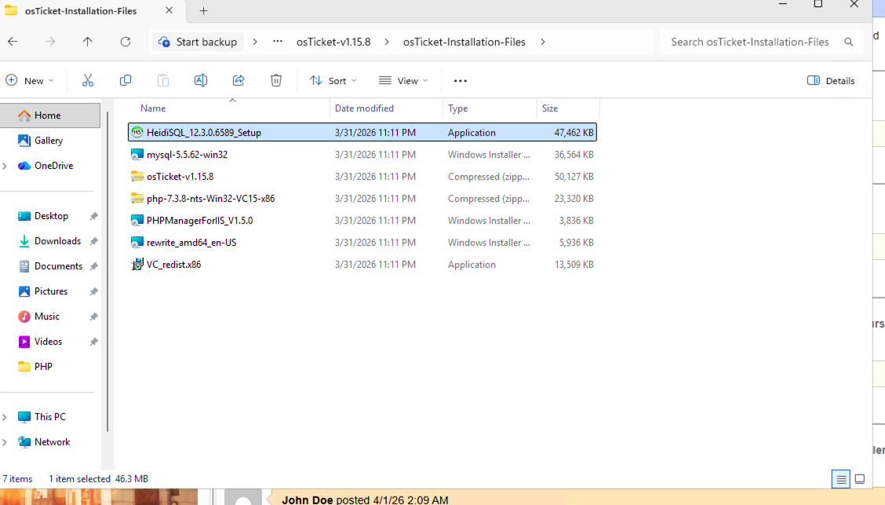

<h1>osTicket - Ticket Lifecycle: Intake Through Resolution</h1>
I deployed and configured a web-based ticketing system by setting up IIS, PHP, and MySQL, and securing the application post-installation . 

<h2>Environments and Technologies Used</h2>

- Microsoft Azure (Virtual Machines/Compute)
- Remote Desktop Protocol (RDP)
- Internet Information Services (IIS)
- Hypertext Preprocessor (PHP)
- Common Gateway interface (CGI)
- MySQL (Database Server)

<h2>Operating Systems Used </h2>

- Windows 11</b> (25H2)

<h2>Key Skills Demonstrated Stages</h2>

- IT infrastructure setup (Azure VM, IIS)  
- Software deployment and dependency management (PHP, MySQL, osTicket)  
- Helpdesk workflow understanding  
- Role-based access control and permissions  
- SLA and ticket prioritization configuration  
- Troubleshooting and system administration

  # Step 1: Create Azure Windows 11 Pro VM

1. Log in to Azure Portal.
2. Navigate to **Virtual Machines > Create > Virtual Machine**.
3. Configure:
   - Name: `osticket-vm`
   - Region: [Choose your region]
   - Image: Windows 11Pro
   - Size: 4 vCPUs
   - Username: 
   - Password: 
4. Enable **RDP (Remote Desktop Protocol)** access.
5. Complete VM creation.
6. Connect using Remote Desktop.

<h2>Lifecycle Stages</h2>

   

   # Step 2: IIS, PHP, and MySQL Setup

## Install IIS with CGI
1. Open Windows Features.
2. Enable:
   - Internet Information Services
   - World Wide Web Services → Application Development Features → [X] CGI

## Install Dependencies
1. From `Lab-Files/`, install:
   - `PHPManagerForIIS_V1.5.0.msi`
   - `rewrite_amd64_en-US.msi`
   - `VC_redist.x86.exe`
   - `MySQL 5.5.62-win32.msi` (Typical Setup → Launch Configuration Wizard → Standard → root/root)
2. Create directory: `C:\PHP`
3. Unzip `php-7.3.8-nts-Win32-VC15-x86.zip` into `C:\PHP`.

## Configure IIS for PHP
1. Open IIS as Admin.
2. Use PHP Manager → Register `C:\PHP\php-cgi.exe`.
3. Reload IIS (Stop → Start).

 

 

  

---

# Step 3: Install osTicket

1. Unzip `osTicket-v1.15.8.zip` → copy `upload` folder to `C:\inetpub\wwwroot`.
2. Rename `upload` → `osTicket`.
3. Reload IIS (Stop → Start).
4. Open `http://localhost/osTicket` in browser.

## Enable PHP Extensions
- In IIS → osTicket → PHP Manager → Enable:
  - php_imap.dll
  - php_intl.dll
  - php_opcache.dll

## Configure osTicket
1. Rename `ost-sampleconfig.php` → `ost-config.php`.
2. Assign permissions:
   - Disable inheritance → Remove All
   - Add Everyone → Full Control
3. Continue setup in browser:
   - Name: Helpdesk
   - Default email: receives tickets

## Database Setup
1. Install `HeidiSQL` from Lab-Files.
2. Connect: root/root → create database `osTicket`.
3. Continue installation in browser:
   - MySQL Database: osTicket
   - Username: root

Ticket Lifecycle – Role-Based Workflow
   # Step 5: Ticketing Workflow Practice

## Sample Tickets
| Ticket | Description | Department | SLA |
|--------|------------|------------|-----|
| 1 | Entire mobile/online banking system is down | Online Banking | Sev-A (1h, 24/7) |
| 2 | Accounting department needs Adobe upgrade | Support | Sev-B (4h, 24/7) |
| 3 | CFO’s laptop won’t turn on | Support | Sev-B (4h, 24/7) |

## Agent Workflow
- Log in as John → observe ticket properties
- Assign SLA, department
- Resolve ticket or escalate
- Observe permissions impact (Sev-A restricted)
- Log in as Jane → manage escalated tickets

## Takeaways
- End-to-end ticket lifecycle
- Role-based access control
- SLA management
- Email notifications for updates
- Realistic IT helpdesk workflow

 
